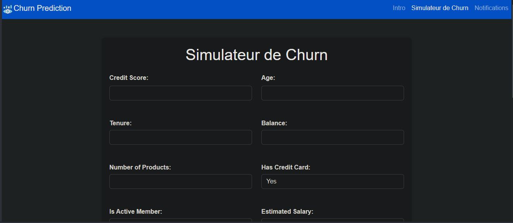
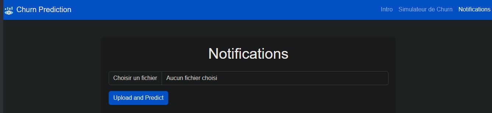
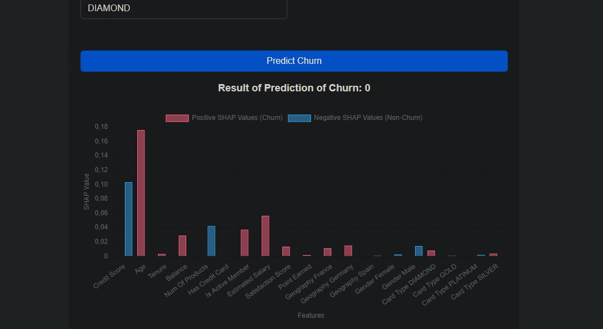
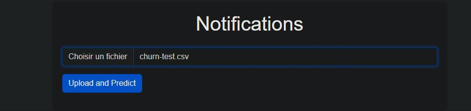
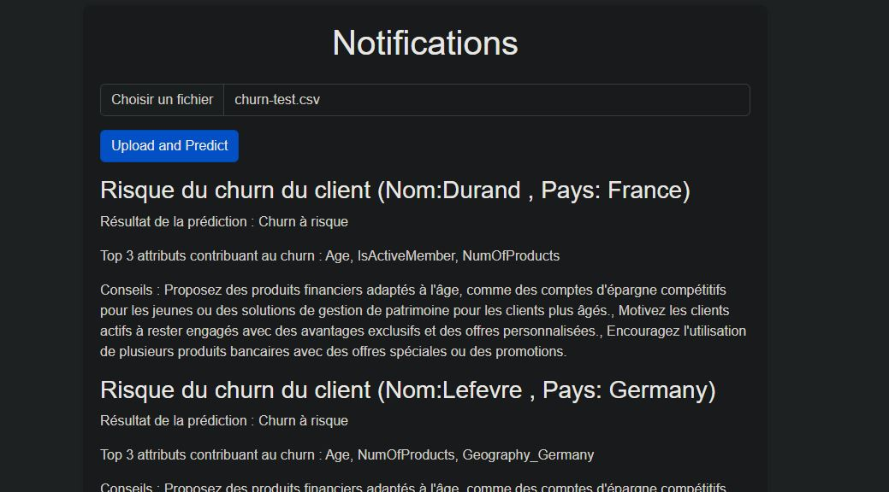

# Churn Prediction Application

- L'application **Churn Prediction** est une solution de prédiction de la fidélité des clients, basée sur un modèle de machine learning pré-entraîné. Elle permet de prédire la probabilité qu'un client quitte une banque en se basant sur des critères tels que le score de crédit, l'âge, le nombre de produits détenus, et d'autres facteurs financiers et démographiques.
- Le document `Projet iA_Churn bancaire_KhaoulaA_ManuelFB_IsmailO.pdf` sur ce git donne une explication du projet dans tous ses aspects.
- Les notebooks sur l'analyse EDA des données ainsi que le notebook du modèle et les données sont dans le dossier `app/model` dans ce git.

# Churn Prediction API

Cette API utilise Flask pour fournir des prédictions de churn basées sur un modèle de machine learning pré-entraîné.

## Prérequis

Avant de commencer, assurez-vous d'avoir installé les éléments suivants :

- Python 3.10 ou supérieur
- `pip` pour gérer les paquets Python

## Installation du Backend

1. **Cloner le dépôt :**

   ```sh
   git clone https://github.com/khaoula051999/bank-churn.git
   cd bank-churn
   ```

2. **Créer un environnement virtuel :**

   ```sh
   python -m venv venv
   ```

3. **Activer l'environnement virtuel :**

   - Sous Windows :
     ```sh
     venv\Scripts\activate
     ```
   - Sous macOS et Linux :
     ```sh
     source venv/bin/activate
     ```

4. **Installer les dépendances :**
   ```sh
   pip install -r requirements.txt
   ```

## Utilisation

1. **Assurez-vous que les fichiers `best_model.pkl` et `scaler.pkl` sont présents dans le répertoire `model`.**

2. **Naviguer dans le répertoire `app` :**

   ```sh
   cd app
   ```

3. **Lancer l'application Flask :**

   ```sh
   python app.py
   ```

4. **Tester l'API avec Postman**:
   - **Méthode** : `POST`
   - **URL** : `http://127.0.0.1:5000/predict`
   - **Headers** : Ajouter `Content-Type: application/json`
   - **Body** : Sélectionnez "raw", puis "JSON" et ajoutez le JSON suivant :
   ```json
   {
     "CreditScore": 600,
     "Age": 40,
     "Tenure": 3,
     "Balance": 60000,
     "NumOfProducts": 2,
     "HasCrCard": 1,
     "IsActiveMember": 1,
     "EstimatedSalary": 50000,
     "Satisfaction Score": 3,
     "Point Earned": 200,
     "Geography_France": 1,
     "Geography_Germany": 0,
     "Geography_Spain": 0,
     "Gender_Female": 1,
     "Gender_Male": 0,
     "Card Type_DIAMOND": 0,
     "Card Type_GOLD": 1,
     "Card Type_PLATINUM": 0,
     "Card Type_SILVER": 0
   }
   ```

## Lancement du Frontend

Pour lancer le frontend de l'application de prédiction de churn, suivez les étapes ci-dessous :

1. **Assurez-vous que le backend est en cours d'exécution :**

   - Commencez par vous assurer que le serveur backend fonctionne. Vous pouvez démarrer le backend en accédant au répertoire `app` et en exécutant :
     ```bash
     python app.py
     ```
   - Le backend devrait être en cours d'exécution sur `http://127.0.0.1:5000`.

2. **Accédez au répertoire du frontend :**

   - Ouvrez une nouvelle fenêtre de terminal et accédez au répertoire `template` où se trouvent vos fichiers HTML :
     ```bash
     cd template
     ```

3. **Démarrez un serveur HTTP local :**

   - Pour servir les fichiers HTML, utilisez le serveur HTTP intégré de Python. Exécutez la commande suivante :
     ```bash
     python -m http.server 8000
     ```
   - Cela démarrera un serveur local sur `http://127.0.0.1:8000`.

4. **Accédez à l'application :**

   - Ouvrez votre navigateur web et allez sur `http://127.0.0.1:8000/index.html` pour accéder à la page d'introduction.
   - Vous pouvez naviguer vers d'autres pages comme `simulator.html` ou `notifications.html` en utilisant le menu.

5. **Tester et utiliser l'application :**
   - Vous pouvez maintenant utiliser l'application en entrant les données requises dans le formulaire sur la page "Simulateur de Churn" et en cliquant sur "Predict Churn" pour obtenir la prédiction de churn.

**Note :** Assurez-vous que le backend est en cours d'exécution avant de commencer à tester le frontend pour que l'application fonctionne correctement.

## Description de l'application

### Fonctionnalités principales

1. **Simulateur de Churn** :

   - Le simulateur permet à l'utilisateur d'entrer manuellement des informations sur un client spécifique pour obtenir une prédiction de churn en temps réel.
   - Vous pouvez accéder au simulateur via le menu dans le frontend.

   

2. **Notifications** :

   - Vous pouvez télécharger un fichier CSV contenant les informations de plusieurs clients via la page des notifications `notifications.html`. L'application analysera ces données et affichera les clients à risque de churn avec des recommandations sur les mesures à prendre.On a mis un fichier `churn-test.csv` dans le fichiers assets afin de tester cette fonctionalité.
     

   - Chaque client pour lequel la prédiction montre un risque de churn (`1` pour un client susceptible de quitter la banque) est accompagné d'une explication basée sur les attributs principaux qui influencent la prédiction et de recommendations de solution basé sur ces attributs qui ont menés au Churn.

### Explication des prédictions

L'application utilise la librairie **SHAP** (SHapley Additive exPlanations) pour fournir une explicabilité des modèles de machine learning. Pour chaque prédiction de churn, on depuis les données d'explcabilité de SHAP identifie les trois principaux attributs qui influencent la décision, offrant ainsi aux utilisateurs des insights sur les raisons sous-jacentes de la prédiction.

### Exemple d'utilisation

1. **Tester un client individuel** :

   - Via le simulateur de churn, entrez les données relatives à un client, telles que le score de crédit, l'âge, le solde, et le type de carte. Cliquez sur "Predict Churn" pour recevoir une prédiction et une explication des facteurs influençant cette décision.
     

2. **Téléchargement d'un fichier CSV** :

   - Sur la page `notifications`, vous pouvez charger un fichier CSV contenant les informations de plusieurs clients. L'application analysera les données et fournira une liste des clients à risque de churn, ainsi que des recommandations spécifiques pour chaque client.
     

3. **Recommandations personnalisées** :

   - Pour chaque client à risque, l'application génère des recommandations en fonction des attributs influents (par exemple, augmenter le nombre de produits détenus ou améliorer la satisfaction du client).

   
